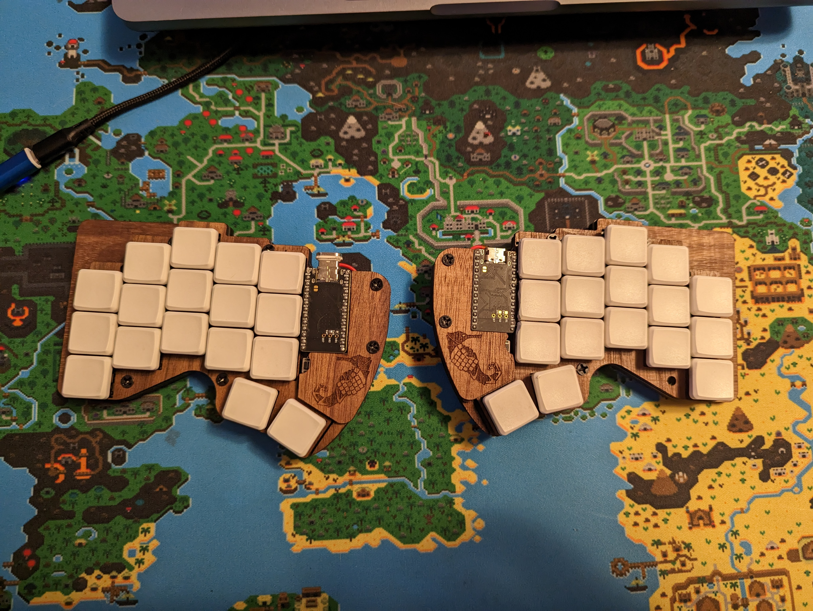

# The Seahorse V1 or The RoadRunner
------
This keyboard design works well, but had a couple of issues. The main one was that the micro-controller is too close to the keys, which required the user to shave off some of the key caps to get it all to fit.

In other words, build at your own risk.

